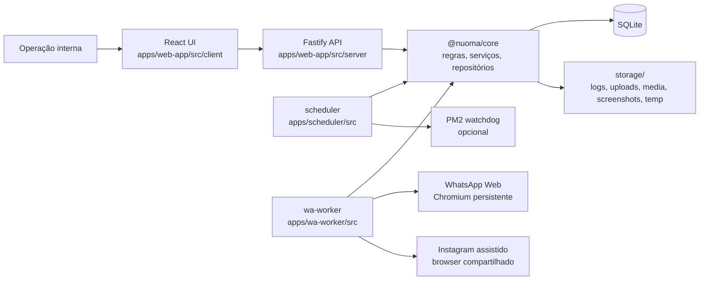
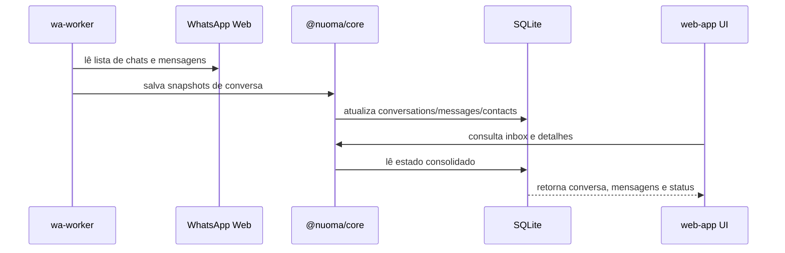

# Nuoma WPP


CRM operacional local com automação multicanal, inbox, campanhas, automações por regra e observabilidade de runtime.

O projeto é organizado como monorepo `npm workspaces`, com três processos principais em execução local:

- `web-app`: API HTTP + interface React
- `wa-worker`: automação browser-based do WhatsApp Web
- `scheduler`: ciclos periódicos, watchdog e disparo operacional

## Sumário

- [Visão Geral](#visão-geral)
- [Objetivo Do Sistema](#objetivo-do-sistema)
- [Stack](#stack)
- [Arquitetura](#arquitetura)
- [Estrutura De Pastas](#estrutura-de-pastas)
- [Instalação](#instalação)
- [Configuração De Ambiente](#configuração-de-ambiente)
- [Execução E Comandos](#execução-e-comandos)
- [Fluxos Principais](#fluxos-principais)
- [Integrações](#integrações)
- [Superfície HTTP E Telas](#superfície-http-e-telas)
- [Persistência E Runtime](#persistência-e-runtime)
- [Convenções Do Projeto](#convenções-do-projeto)
- [Documentação Relacionada](#documentação-relacionada)
- [Melhorias Futuras](#melhorias-futuras)

## Visão Geral

`Nuoma WPP` é uma aplicação local-first para operação interna de CRM. O sistema centraliza:

- gestão de contatos e tags
- inbox operacional com histórico de mensagens
- campanhas com importação CSV e etapas sequenciais
- automações baseadas em regras
- observabilidade de worker, scheduler, filas e logs
- operação assistida para Instagram e runtime dedicado para WhatsApp Web

O núcleo do produto roda localmente sobre `SQLite`, com o `wa-worker` automatizando um `Chromium` persistente via `Playwright`.

## Objetivo Do Sistema

O objetivo atual do sistema é ser um CRM operacional com automação multicanal para uso interno.

Prioridades refletidas no código atual:

1. estabilidade operacional
2. rastreabilidade e observabilidade
3. manutenção local e previsível
4. evolução incremental sem depender de infraestrutura distribuída

## Stack

| Camada | Tecnologias |
| --- | --- |
| Monorepo | `npm workspaces` |
| Runtime | `Node.js 22+` |
| Linguagem | `TypeScript` ESM |
| Backend HTTP | `Fastify` |
| Frontend | `React 19`, `React Router 7`, `TanStack Query`, `Vite 7`, `Tailwind CSS 3`, `Radix UI` |
| Banco | `SQLite` com `better-sqlite3` |
| Worker browser-based | `Playwright` com `Chromium` persistente |
| Validação | `zod` |
| Logs | `pino` + persistência local |
| Processo | `PM2` |
| Testes | `node:test` + `tsx` |

## Arquitetura

### Visão De Alto Nível



### Papéis Das Camadas

| Camada | Responsabilidade principal |
| --- | --- |
| `apps/web-app` | expõe a API, serve a SPA e concentra a interface operacional |
| `apps/wa-worker` | mantém o browser persistente, sincroniza inbox e executa envios |
| `apps/scheduler` | roda automações, campanhas, limpeza e watchdog |
| `packages/core` | contratos, acesso ao banco, serviços, repositórios, utilitários e validação |

### Modelo De Execução

- Em desenvolvimento, o `web-app` sobe `Fastify` e injeta `Vite` em modo middleware.
- Em build local, o `web-app` serve `apps/web-app/dist/client`.
- O `wa-worker` mantém o perfil persistente do `Chromium` em `storage/chromium-profile/whatsapp`.
- O `scheduler` executa ciclos periódicos com base em `SCHEDULER_INTERVAL_SEC`.
- O estado de runtime é publicado em `worker_state` e consumido pela tela `#/health`.

## Estrutura De Pastas

```text
.
├── apps/
│   ├── web-app/
│   │   ├── src/client/
│   │   └── src/server/
│   ├── wa-worker/
│   │   └── src/
│   └── scheduler/
│       └── src/
├── packages/
│   └── core/
│       └── src/
├── docs/
├── tests/
├── storage/
│   ├── chromium-profile/
│   ├── database/
│   ├── logs/
│   ├── media/
│   ├── screenshots/
│   ├── temp/
│   └── uploads/
├── ecosystem.config.cjs
├── package.json
└── .env.example
```

### Pastas Mais Relevantes

| Caminho | Conteúdo |
| --- | --- |
| `apps/web-app/src/client` | páginas, componentes e utilitários de UI |
| `apps/web-app/src/server/routes` | superfície HTTP do sistema |
| `apps/web-app/src/server/lib` | adaptadores locais, uploads e integração assistida |
| `apps/wa-worker/src` | boot do worker, Playwright, sync e envio |
| `apps/scheduler/src` | ciclo operacional, watchdog e limpeza |
| `packages/core/src/config` | leitura e resolução de ambiente |
| `packages/core/src/db` | conexão SQLite e migrations |
| `packages/core/src/repositories` | acesso a dados |
| `packages/core/src/services` | casos de uso e processamento |
| `packages/core/src/types` | tipos e schemas de domínio |

## Instalação

### Pré-requisitos

- macOS
- `Node.js >= 22`
- `npm >= 10`
- Chromium instalado pelo Playwright

Observação importante: o worker usa utilitários nativos do macOS como `afconvert` e `sips` para conversão de mídia em alguns fluxos. O setup atual foi claramente orientado para operação local em macOS.

### Passo A Passo

```bash
cp .env.example .env
npm install
npx playwright install chromium
npm run db:migrate
npm run db:seed
```

### Primeiro Uso Do WhatsApp

1. Garanta `CHROMIUM_HEADLESS=false` no `.env`.
2. Suba o worker:

```bash
npm run start --workspace @nuoma/wa-worker
```

3. Escaneie o QR code no Chromium persistente.
4. O perfil ficará salvo em `storage/chromium-profile/whatsapp`.

## Configuração De Ambiente

O arquivo base é [`.env.example`](/Users/gabrielbraga/Projetos/nuoma-wpp/.env.example). A resolução final das variáveis e defaults vive em [env.ts](/Users/gabrielbraga/Projetos/nuoma-wpp/packages/core/src/config/env.ts).

### Grupos Principais

| Grupo | Variáveis relevantes |
| --- | --- |
| App | `APP_PORT`, `APP_HOST`, `APP_NAME`, `NODE_ENV` |
| Storage | `DATABASE_PATH`, `LOG_DIR`, `UPLOADS_DIR`, `MEDIA_DIR`, `TEMP_DIR`, `SCREENSHOTS_DIR` |
| Chromium / Worker | `CHROMIUM_PROFILE_DIR`, `CHROMIUM_CHANNEL`, `CHROMIUM_HEADLESS`, `PLAYWRIGHT_SLOW_MO`, `WORKER_HEARTBEAT_SEC`, `WORKER_MAX_RSS_MB` |
| WhatsApp | `WA_URL`, `WA_SYNC_INTERVAL_SEC`, `WA_SYNC_CHATS_LIMIT`, `WA_SYNC_MESSAGES_LIMIT` |
| Instagram assistido | `IG_USE_SHARED_BROWSER`, `IG_OPEN_ON_STARTUP`, `IG_ENABLE_INBOX_SYNC`, `IG_SYNC_INTERVAL_SEC` |
| Scheduler | `SCHEDULER_INTERVAL_SEC`, `WATCHDOG_STALE_SECONDS`, `ENABLE_PM2_WATCHDOG` |
| Feature flags | `ENABLE_CAMPAIGNS`, `ENABLE_AUTOMATIONS`, `ENABLE_POST_PROCEDURE`, `ENABLE_UPLOADS` |
| AI / Data Lake | `DATA_LAKE_DIR`, `AI_PROVIDER`, `OPENAI_API_KEY`, `OLLAMA_HOST`, `WHISPER_BIN` |

### Notas De Configuração

- Nem todas as variáveis opcionais aparecem em `.env.example`; algumas têm default definido apenas no schema do `core`.
- `WEB_APP_URL` pode ficar vazio; nesse caso o worker resolve a URL com `APP_HOST` e `APP_PORT`.
- O watchdog de restart via PM2 só atua quando `ENABLE_PM2_WATCHDOG=true`.
- O `data lake` existe no código, mas não faz parte do fluxo central do CRM operacional.

## Execução E Comandos

### Desenvolvimento

Sobe `web-app`, `wa-worker` e `scheduler` em paralelo:

```bash
npm run dev
```

Interface local padrão:

- `http://127.0.0.1:3000`
- rotas da UI usam hash router, por exemplo `#/`, `#/inbox`, `#/health`

### Build E Operação Local

```bash
npm run build
npm run start
```

O startup produtivo usa [ecosystem.config.cjs](/Users/gabrielbraga/Projetos/nuoma-wpp/ecosystem.config.cjs), com três processos:

- `web-app`
- `wa-worker`
- `scheduler`

### Comandos Úteis

```bash
npm run typecheck
npm run hygiene
npm test
npm run db:migrate
npm run db:seed
npm run db:import:instagram -- <args>
```

## Fluxos Principais

### 1. Inbox E Sincronização De Conversas



### 2. Campanhas

- A operação cria ou edita campanhas pela UI.
- O `web-app` valida payloads com schemas do `core`.
- Destinatários podem ser importados via CSV.
- O `scheduler` roda `processCampaignTick()`.
- O `wa-worker` consome jobs de envio.
- O banco registra execução, status, erros e progresso.

### 3. Automações

- Regras são definidas por categoria.
- O `scheduler` roda `processAutomationTick()`.
- O `core` avalia elegibilidade, janelas e delays.
- Jobs resultantes entram na fila `jobs`.
- O `wa-worker` executa o envio e devolve estado operacional.

### 4. Envio Manual

- Para `WhatsApp`, a API cria job `send-message`.
- Para `Instagram`, o envio assistido pode ocorrer diretamente pelo serviço de browser.
- O histórico da conversa é atualizado após o envio.

## Integrações

### WhatsApp Web

- Integração principal de envio e sincronização.
- Runtime dedicado em `Chromium` persistente.
- Sessão isolada do navegador pessoal.
- Heartbeat, artifacts e estado publicados para observabilidade.

### Instagram Assistido

- Há suporte assistido para sessão, sync de inbox e envio manual.
- Quando `IG_USE_SHARED_BROWSER=true`, o Instagram pode compartilhar o mesmo browser do worker.
- O sync assistido passa por [instagram-sync.ts](/Users/gabrielbraga/Projetos/nuoma-wpp/apps/web-app/src/server/lib/instagram-sync.ts) e serviços do `core`.

### Uploads CSV E Mídia

- CSV é usado para importação de destinatários de campanha.
- Uploads de mídia suportam fluxos de campanha e automação.
- Parsing CSV passa por [uploads.ts](/Users/gabrielbraga/Projetos/nuoma-wpp/apps/web-app/src/server/lib/uploads.ts).

### Data Lake E AI

- O código possui rota, migrations e serviços para `data lake`.
- Também há suporte configurável para OpenAI, Ollama e Whisper.
- Essa trilha existe no repositório, mas não é o centro do fluxo operacional do CRM.

## Superfície HTTP E Telas

### Grupos De Rotas HTTP

| Grupo | Arquivo |
| --- | --- |
| sistema, health, logs, settings, dashboard | [system.ts](/Users/gabrielbraga/Projetos/nuoma-wpp/apps/web-app/src/server/routes/system.ts) |
| contatos | [contacts.ts](/Users/gabrielbraga/Projetos/nuoma-wpp/apps/web-app/src/server/routes/contacts.ts) |
| tags | [tags.ts](/Users/gabrielbraga/Projetos/nuoma-wpp/apps/web-app/src/server/routes/tags.ts) |
| conversas e mensagens | [conversations.ts](/Users/gabrielbraga/Projetos/nuoma-wpp/apps/web-app/src/server/routes/conversations.ts) |
| automações | [automations.ts](/Users/gabrielbraga/Projetos/nuoma-wpp/apps/web-app/src/server/routes/automations.ts) |
| campanhas | [campaigns.ts](/Users/gabrielbraga/Projetos/nuoma-wpp/apps/web-app/src/server/routes/campaigns.ts) |
| uploads | [uploads.ts](/Users/gabrielbraga/Projetos/nuoma-wpp/apps/web-app/src/server/routes/uploads.ts) |
| Instagram | [instagram.ts](/Users/gabrielbraga/Projetos/nuoma-wpp/apps/web-app/src/server/routes/instagram.ts) |
| data lake | [data-lake.ts](/Users/gabrielbraga/Projetos/nuoma-wpp/apps/web-app/src/server/routes/data-lake.ts) |

### Páginas Principais Da UI

| Rota | Tela |
| --- | --- |
| `#/` | dashboard operacional |
| `#/inbox` | inbox de conversas |
| `#/contacts` | gestão de contatos |
| `#/contacts/:id` | detalhe de contato |
| `#/automations` | gestão de automações |
| `#/campaigns` | campanhas e builder |
| `#/imports` | importações |
| `#/trends` | tendências e visão analítica |
| `#/health` | saúde do sistema |
| `#/logs` | logs e jobs |
| `#/settings` | configurações |

## Persistência E Runtime

### Banco De Dados

As migrations vivem em [migrations.ts](/Users/gabrielbraga/Projetos/nuoma-wpp/packages/core/src/db/migrations.ts) e hoje cobrem, entre outros:

- `contacts`, `contact_channels`, `contact_tags`, `contact_history`
- `tags`
- `conversations`, `messages`
- `automations`, `automation_actions`, `automation_runs`, `automation_contact_state`
- `campaigns`, `campaign_steps`, `campaign_recipients`, `campaign_executions`
- `jobs`
- `worker_state`
- `system_logs`
- `media_assets`
- `channel_accounts`
- `audit_logs`
- `data_lake_*`

Banco padrão:

- [nuoma.db](/Users/gabrielbraga/Projetos/nuoma-wpp/storage/database/nuoma.db)

### Diretórios Operacionais

| Diretório | Uso |
| --- | --- |
| [storage/logs](/Users/gabrielbraga/Projetos/nuoma-wpp/storage/logs) | logs locais |
| [storage/uploads](/Users/gabrielbraga/Projetos/nuoma-wpp/storage/uploads) | uploads temporários e CSV |
| [storage/media](/Users/gabrielbraga/Projetos/nuoma-wpp/storage/media) | mídia persistida |
| [storage/screenshots](/Users/gabrielbraga/Projetos/nuoma-wpp/storage/screenshots) | artifacts de falha |
| [storage/temp](/Users/gabrielbraga/Projetos/nuoma-wpp/storage/temp) | conversões e arquivos temporários |
| [storage/chromium-profile/whatsapp](/Users/gabrielbraga/Projetos/nuoma-wpp/storage/chromium-profile/whatsapp) | perfil persistente do worker |

### Observabilidade

O sistema já possui:

- `worker_state` para estado dos processos
- `system_logs` para eventos do sistema
- endpoint `GET /health`
- endpoint `GET /logs`
- endpoint `GET /worker/metrics`
- tela `#/health`
- screenshots e, opcionalmente, HTML dump em falhas críticas

## Convenções Do Projeto

### Técnicas

- monorepo com `npm workspaces`
- `TypeScript` ESM em todas as camadas
- contratos e validação concentrados em `packages/core`
- persistência local via `SQLite`
- UI consome API HTTP; não acessa banco diretamente
- worker e scheduler consomem contratos do `core`
- arquivos gerados e artefatos ficam em `storage/`

### Operacionais

- o sistema é orientado a operação local
- mudanças devem priorizar estabilidade operacional
- integrações e visual tendem a ser tratadas com cautela
- o `data lake` segue como trilha separada da operação principal

### Desenvolvimento

- prefira mudanças pequenas e reversíveis
- evite duplicar contratos do backend no frontend quando houver caminho compartilhado
- mantenha docs de arquitetura e operação sincronizadas com o código

## Documentação Relacionada

- [Visão geral da documentação](/Users/gabrielbraga/Projetos/nuoma-wpp/docs/README.md)
- [README do core](/Users/gabrielbraga/Projetos/nuoma-wpp/packages/core/README.md)
- [README do web-app](/Users/gabrielbraga/Projetos/nuoma-wpp/apps/web-app/README.md)
- [README do wa-worker](/Users/gabrielbraga/Projetos/nuoma-wpp/apps/wa-worker/README.md)
- [README do scheduler](/Users/gabrielbraga/Projetos/nuoma-wpp/apps/scheduler/README.md)
- [ADR 0001](/Users/gabrielbraga/Projetos/nuoma-wpp/docs/adr/0001-estabilidade-primeiro.md)
- [Runbook do worker e PM2](/Users/gabrielbraga/Projetos/nuoma-wpp/docs/runbooks/worker-pm2.md)
- [Diagrama de arquitetura](/Users/gabrielbraga/Projetos/nuoma-wpp/docs/diagrams/architecture.md)
- [Fluxo operacional](/Users/gabrielbraga/Projetos/nuoma-wpp/docs/diagrams/runtime-flow.md)

## Melhorias Futuras

Melhorias coerentes com o estado atual do projeto:

- consolidar contratos compartilhados para reduzir drift entre `core`, `server` e `client`
- quebrar hotspots grandes de serviço e worker em unidades menores
- reduzir duplicações simples de utilitários de apresentação
- ampliar documentação de decisões arquiteturais e runbooks
- revisar com mais profundidade a trilha de `data lake` separadamente do CRM operacional
- reforçar cobertura de testes por camada, além da suíte integrada atual

---

Base técnica principal do repositório:

- [package.json](/Users/gabrielbraga/Projetos/nuoma-wpp/package.json)
- [ecosystem.config.cjs](/Users/gabrielbraga/Projetos/nuoma-wpp/ecosystem.config.cjs)
- [env.ts](/Users/gabrielbraga/Projetos/nuoma-wpp/packages/core/src/config/env.ts)
- [routes/index.ts](/Users/gabrielbraga/Projetos/nuoma-wpp/apps/web-app/src/server/routes/index.ts)
