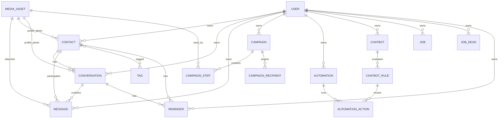

# V2 Data Model

Status: V2.2-V2.5 domain and persistence base implemented.

This document describes the API/domain model and the core SQLite persistence
shape. Worker queue details live in `docs/architecture/V2_JOB_QUEUE.md`.

## Principles

- `userId` exists on operational entities from day one.
- WhatsApp and Instagram share one contact/timeline model.
- `Contact.phone` is nullable so Instagram-only contacts are first-class.
- Message completeness comes from observed WhatsApp DOM snapshots plus
  dedupe, not from unread state alone.
- WhatsApp message timestamps keep declared precision. If WhatsApp exposes only
  minute precision, `messageSecond` stays `null`, `observedAtUtc` stores the
  capture instant, and `waInferredSecond` orders same-minute messages.

## ER

## Entity Groups

### Identity

- `User`: login identity and role.
- `Attendant`: operational human shown in assignments/inbox. It may map to a
  `User` account or exist as an operational label.

### Contact Timeline

- `Contact`: person/profile. `phone` can be `null`; channel-specific identifiers
  such as Instagram handle live alongside the shared profile. Profile photo
  capture stores `profilePhotoMediaAssetId`, `profilePhotoSha256` and
  `profilePhotoUpdatedAt`.
- `Conversation`: channel thread. A contact can have WhatsApp and Instagram
  conversations. It mirrors the profile photo asset/hash so a timeline can show
  capture evidence even before the contact merge model is complete.
- `Message`: normalized timeline item. Stores WhatsApp precision fields:
  `timestampPrecision`, `messageSecond`, `waInferredSecond`, `observedAtUtc`.
- `MediaAsset`: local/S3 media object deduped by SHA256. CRM-owned files use
  the canonical namespace `/nuoma/files/crm/<phone-or-contact>/`; the local
  provider stores this under `crm-files/`, while the S3 provider PUTs the same
  object key to an S3-compatible bucket.
- `AttachmentCandidate`: evidence that an image/audio/video/document was seen
  inside a conversation. It links `conversation`, optional `message` and
  `mediaAsset`, allowing the Inbox to show captured attachments before the
  binary download/S3 pipeline is finalized.

### Growth

- `Campaign`: manual/CSV/evergreen outbound flow with ordered steps.
- `Automation`: event-triggered flow using the same step/action primitives.
- `Chatbot`: reactive message rules as a separate entity, not an automation
  subtype.

### Operations

- `Job`: durable unit of worker/scheduler execution with dedupe and priority.
- `JobDead`: DLQ entry for exhausted/permanent jobs with manual retry.
- `WorkerState`: heartbeat row per worker process.
- `SchedulerLock`: single-owner lock for scheduled orchestration.
- `Reminder`: user-visible follow-up task.
- `Tag`: reusable segmentation label.
- `AuditLog`, `SystemEvent`, `PushSubscription`, `RefreshSession` and
  `PasswordResetToken`: operational/security tables used by persistence and
  auth.

## Contract Location

- Entities: `packages/contracts/src/*.ts`
- Fixtures: `packages/contracts/src/fixtures.ts`
- Schema tests: `packages/contracts/src/domain.test.ts`
