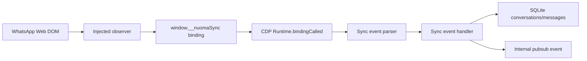

# V2 Sync Engine

Status: V2.6 implemented and smoke-tested against authenticated WhatsApp Web Business.

## Invariant

Unread/badge is never the source of truth. It can prioritize work, but sync
completeness comes from observed DOM events plus the persisted message ledger.

## Flow

## Implemented

- CDP connection to `CHROMIUM_CDP_HOST:CHROMIUM_CDP_PORT`.
- Worker browser opens `WA_WEB_URL` when `WORKER_SYNC_ENABLED=true`.
- When `WORKER_KEEP_BROWSER_OPEN=true`, the worker launches Chromium as a
  detached CDP process so worker restarts do not close the WhatsApp session.
- When `WORKER_KEEP_BROWSER_OPEN=false`, the worker owns Chromium with
  Playwright `launchPersistentContext`; the WhatsApp session still survives
  restarts through `CHROMIUM_PROFILE_DIR`.
- Before launching with a persistent profile, the worker removes stale Chromium
  lock files (`Singleton*` and `DevToolsActivePort`) left by a previous dead
  process. It does not delete profile/session data.
- `Runtime.addBinding` exposes `window.__nuomaSync`.
- `Page.addScriptToEvaluateOnNewDocument` installs the observer for future
  documents.
- Runtime injection also installs the observer in the current document.
- Observer emits:
  - `message-added`
  - `message-updated`
  - `message-removed` when an explicit removal event is available
  - `chat-opened`
  - `conversation-fingerprint-changed`
  - `dom-wa-changed`
  - `profile-photo-captured`
  - `attachment-candidate-captured`
  - `reconcile-snapshot`
- Handler persists:
  - new conversations by `channel + externalThreadId`
  - messages idempotently by `conversationId + externalId`
  - delivery status changes by `externalId`
  - deleted message flags by `externalId`
  - edited message body/status with previous body snapshot in `raw.editHistory`
  - profile photo media assets by SHA256 and links the asset/hash to the
    matching contact and conversation
  - visible attachment candidates as media assets plus `attachment_candidates`
    evidence linked to conversation/message when the external message id exists
- Handler emits an internal pubsub event after each processed event.
- Handler exposes sync metrics in worker heartbeat JSON:
  - `syncEventLatencyMsLast`
  - `syncEventLatencyMsAvg`
  - `syncEventLatencyMsMax`
  - `safetyNetPickedUp`
- Real authenticated smoke on `5531982066263` captured 26 visible messages with
  `parseErrors=0` and `handler errors=0`.
- Hot-window reconcile for the active chat:
  - CDP calls `window.__nuomaSyncReconcile(reason)` every
    `WORKER_SYNC_RECONCILE_MS`.
  - Fingerprint changes in `#pane-side` trigger an immediate reconcile pass.
  - Reconcile re-emits the visible bubble snapshot and relies on
    `messages.insertOrIgnore`, so unread/badge is not a completeness condition.
  - Each pass emits `reconcile-snapshot` with visible count and first/last
    external ids for observability.
- Multi-chat hot-window reconcile is available behind
  `WORKER_SYNC_MULTI_CHAT_ENABLED=true`:
  - Observer extracts phone and named sidebar candidates from `#pane-side`.
  - CDP counts candidates and skipped no-phone rows.
  - CDP navigates passively with `/send?phone=...`, never touches the composer,
    and re-runs active-chat reconcile after each phone-navigation.
  - `WA_INBOX_TARGET_PHONE` can restore a known test chat after the cycle.
  - Named/no-phone rows are observed but skipped by CDP until a resolver exists.
- `sync.forceConversation(convId)` is represented by the
  `sync_conversation` job and admin endpoint
  `POST /api/admin/sync/conversations/:id/force`.
- Forced phone reconcile preserves the canonical conversation id. When CDP opens
  WhatsApp via `/send?phone=...` but the DOM reports only the chat title, the
  observer includes `conversationId`/`candidatePhone` in `raw.reconcileDetails`
  and the handler routes messages into the requested conversation instead of
  creating a duplicate title-only thread.
- Generic WhatsApp titles such as `WhatsApp` or `WhatsApp Business` never
  overwrite an existing conversation title. If a same-thread event arrives with
  a generic title, the handler keeps the persisted title.
- Empty generic `WhatsApp`/`WhatsApp Business` placeholder threads are excluded
  from the Inbox conversation list until they have a real message timestamp.
- `sync_history` and `sync_inbox_force` are safe sync-only jobs; they call the
  same force-reconcile runtime and never send messages.
- The connected CDP runtime also exposes the guarded text sender used by
  `send_message` jobs:
  - it navigates to `/send?phone=...` before sending by default;
  - reconciles before/after send;
  - inserts text through the WhatsApp composer;
  - records the last visible external id before/after send;
  - open-chat reuse is disabled by default and only returns
    `navigationMode="reused-open-chat"` when
    `WORKER_SEND_REUSE_OPEN_CHAT_ENABLED=true`.
- The connected CDP runtime also exposes the guarded native voice sender used by
  `send_voice` jobs:
  - it prepares source audio as WAV PCM 48kHz mono 16-bit, converting non-WAV
    inputs into `WORKER_TEMP_DIR`;
  - it measures duration with `ffprobe` or `afinfo`;
  - it injects a Web Audio/getUserMedia override with
    `Page.addScriptToEvaluateOnNewDocument`;
  - it uses WhatsApp's native voice recorder UI instead of sending an audio
    attachment;
  - it reconciles by the external id observed after the send and records native
    voice evidence plus displayed duration in `sender.voice_message.completed`;
  - it uses the same default-navigate/open-chat-reuse gate as text jobs.
- The connected CDP runtime can capture the active chat profile photo:
  - observer exposes `window.__nuomaSyncProfilePhoto`;
  - CDP calls it after `chat-opened` and `reconcile-snapshot`;
  - browser returns the header image bytes/hash, Node recomputes SHA256 before
    writing the file under local `media-assets/<user>/profile-photos/<thread>/`;
  - the worker emits `profile-photo-captured`;
  - the handler deduplicates `media_assets` and updates
    `contacts.profilePhoto*` plus `conversations.profilePhoto*`.
- The observer also records visible media attachment candidates without
  downloading the binary yet:
  - image, audio/voice, video and document bubbles emit
    `attachment-candidate-captured`;
  - the candidate stores a deterministic visible-DOM hash, mime guess, caption,
    source URL when available and `wa-visible://<hash>` storage marker;
  - the handler deduplicates the candidate by conversation, external message id
    and media asset, then exposes the evidence in the Inbox sidebar.
- `sync_history` requires `payload.conversationId` and runs a bounded historical
  backfill:
  - it reconciles the visible bubble window into the canonical conversation;
  - checks whether every visible `externalId` already exists in SQLite;
  - only then scrolls one window upward and reconciles older visible bubbles;
  - `payload.maxScrolls` is bounded to `1..25`, default `3`;
  - `payload.delayMs` is bounded to `250..10000`, default `1200`.
- Workers without a connected sync runtime exclude `sync_conversation`,
  `sync_history` and `sync_inbox_force` during job claim, preventing a generic
  worker from consuming sync jobs.
- DOM-shape anomalies and safety-net pickups are written to `system_events` for
  admin surfacing.
- Admin can inspect events through `GET /api/admin/system/events`.
- The Inbox exposes separate actions for quick reconcile ("Ressincronizar") and
  bounded history backfill ("Histórico") with selectable `maxScrolls` depth.
- The Inbox timeline renders persisted messages from
  `messages.listByConversation`, orders them by `waDisplayedAt` plus
  `messageSecond/waInferredSecond`, shows status/precision/edit/delete/edge-case
  badges and exposes a per-message inspector with `externalId`, displayed time,
  capture time, timestamp precision, edit history and raw observer payload.
- Devex helpers:
  - `createJsonlSyncEventRecorder` records sync events as JSONL and replays them
    in tests.
  - `filterWhatsAppFlowTrace` filters V2 traces by WhatsApp phone/thread.
  - `tests/fixtures/wa-web.html` keeps a static WA-like fixture.
- Instagram has an isolated observer script following the same binding/event
  pattern. It is not injected into the WhatsApp runtime.

## Timestamp Policy

WhatsApp Web commonly exposes minute precision only. The observer first reads
nested `data-pre-plain-text`; when WhatsApp only exposes visible metadata, it
falls back to the visible bubble time plus the visible date separator. V2 stores:

- `timestampPrecision='minute'`
- `messageSecond=NULL`
- `observedAtUtc` with real capture second/millisecond
- `waDisplayedAt` in Brazil time (`-03:00`)
- `waInferredSecond` derived from visible DOM order

For same-minute visible messages, the newest visible message receives inferred
second `59`, the previous `58`, then `57`, and so on.

If WhatsApp exposes real seconds in the future, V2 stores
`timestampPrecision='second'` and fills `messageSecond`.

## Safety

`WORKER_SYNC_ENABLED=false` by default. Enabling sync observation only reads DOM
and writes local SQLite state.

Text sending is a separate job-path action and is blocked unless all conditions
hold:

- the worker has a connected WhatsApp CDP runtime;
- the job type is `send_message`;
- `WA_SEND_POLICY_MODE=test` has `WA_SEND_ALLOWED_PHONES` or legacy
  `WA_SEND_ALLOWED_PHONE` containing the resolved target phone, or
  `WA_SEND_POLICY_MODE=production` allows the target through the optional canary
  allowlist;
- `WA_SEND_RATE_LIMIT_MAX` within `WA_SEND_RATE_LIMIT_WINDOW_MS` is not exceeded;
- the payload body is non-empty.

During local smoke, `WA_SEND_POLICY_MODE` must stay `test` and the allowed phone
list must stay scoped to the dedicated test number `5531982066263`.

## Session Preservation

Real WhatsApp smoke tests must reuse the persistent Chromium profile at
`CHROMIUM_PROFILE_DIR`. Do not delete this directory unless intentionally
resetting the WhatsApp Web device.

Defaults preserve the session:

- `WORKER_BROWSER_ATTACH_EXISTING=true`: if CDP is already listening, the worker
  attaches instead of launching a second browser.
- `WORKER_KEEP_BROWSER_OPEN=true`: when the worker must launch Chromium, it
  launches a detached CDP process and leaves it open so a smoke restart does not
  force a new QR.
- `WORKER_KEEP_BROWSER_OPEN=false`: recommended for Docker hosted when the
  worker process should own Chromium. The persisted profile still keeps the
  WhatsApp session across container restarts.
- The worker opens `WA_WEB_URL` only when there is no current WhatsApp tab.
- `WORKER_SYNC_RECONCILE_MS=60000`: active-chat hot-window reconcile cadence.
- `WORKER_SYNC_MULTI_CHAT_ENABLED=false`: multi-chat navigation stays opt-in.
- `WORKER_SYNC_MULTI_CHAT_LIMIT=5`: maximum sidebar phone candidates per cycle.
- `WORKER_SYNC_MULTI_CHAT_DELAY_MS=1200`: wait after each passive navigation.
- `WORKER_SEND_REUSE_OPEN_CHAT_ENABLED=false`: real sends always navigate to
  the job phone unless open-chat reuse is explicitly enabled for a controlled
  IC-2 regression run.

## Current Test Coverage

- Timestamp parser and inferred-second ordering.
- Sync handler persistence against temporary SQLite.
- Observer script against static WhatsApp-like HTML in isolated Chromium.
- History-scroll guard: virtualized DOM exits do not emit deletion events.
- JSONL sync event recorder and phone-scoped WA trace filter.
- Multi-chat sidebar extraction for phone and named/no-phone rows.

## Operational Caveats

- Multi-chat navigation stays opt-in. It only navigates phone-resolvable rows;
  named/no-phone rows are counted and skipped.
- Existing duplicate rows from earlier smoke runs can be handled by a later
  stabilization resync/merge pass; the current runtime fix prevents new forced
  phone reconciles from splitting messages across title-only and phone threads.
- WhatsApp virtualizes message bubbles while scrolling. The observer removes
  vanished `data-id`s from its local seen cache but does not emit
  `message-removed` from DOM absence, so historical backfill does not mark
  older visible windows as deleted.
- `dom-wa-changed` is suppressed while WhatsApp is still loading a
  `/send?phone=...` navigation, reducing false positives during force-sync.
- `system_events` is the current admin alert sink. Real browser push delivery can
  be wired when the admin notification surface lands.
- Full Instagram runtime injection is intentionally separate from the WhatsApp
  worker path.
