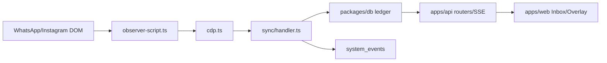

# V2 Sync Engine

Data: 2026-06-12

## Objetivo

O motor de sync V2 transforma o DOM observado no WhatsApp/Instagram em ledger
persistente, sem depender de unread/badge como fonte de verdade.

## Princípios

- DOM observado e a verdade do momento; DB e ledger/dedup.
- `unreadCount` prioriza probes, mas nunca prova completude.
- Toda conversa aberta gera snapshot dos bubbles visíveis e `insertOrIgnore`.
- Realtime observer, hot-window reconcile e backfill histórico são loops
  separados.
- Timestamp do WhatsApp pode ter precisão de minuto; `observed_at_utc` e ordem
  DOM desempatatam mensagens no mesmo minuto.

## Componentes

```mermaid
flowchart LR
  W["WhatsApp/Instagram DOM"] --> O["observer-script.ts"]
  O --> C["cdp.ts"]
  C --> H["sync/handler.ts"]
  H --> D["packages/db ledger"]
  H --> E["system_events"]
  D --> A["apps/api routers/SSE"]
  A --> UI["apps/web Inbox/Overlay"]
```

## Arquivos-chave

- `apps/worker/src/sync/observer-script.ts`: captura DOM WhatsApp.
- `apps/worker/src/sync/cdp.ts`: sessão CDP, probes e browser automation.
- `apps/worker/src/sync/handler.ts`: normalização e persistência.
- `apps/worker/src/instagram/sync.ts`: trilha assistida de Instagram.
- `apps/api/src/routes/global-events.ts`: SSE para updates de Inbox/system.
- `apps/web/src/inbox/use-inbox-events.ts`: cliente de eventos de Inbox.

## Edge Cases

- Contato salvo com nome que parece telefone não deve virar identidade canônica.
- Virtualização do WhatsApp não pode ser confundida com deleção de mensagem.
- Troca de `#main` exige reanexar observer.
- Mensagens no mesmo minuto usam ordem DOM e `observed_at_utc` para ordenação.
- Falha de SSE deve cair para polling controlado no cliente.

## Validação

- `npm run test --workspace @nuoma/worker -- src/sync`
- `npm run test:sync-top5`
- `npm run test:v29-reconciliation`
- `npm run test:v213-global-events`
