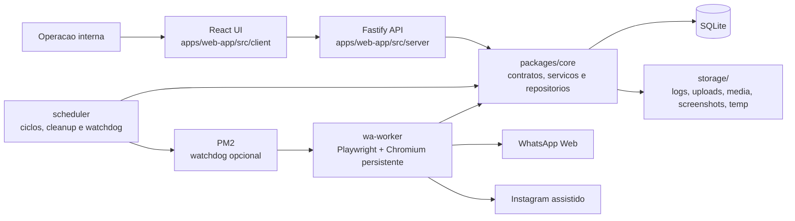

# Diagrama de Arquitetura Geral

## O que este diagrama mostra

Este diagrama resume a arquitetura real do projeto em producao local. A operacao usa a interface React, que e servida pelo `web-app`. O `web-app` expõe API HTTP e delega regras, persistencia e contratos para `packages/core`, que por sua vez conversa com o `SQLite` e com os diretorios operacionais em `storage/`.

Tambem ficam visiveis os dois processos de runtime fora da interface principal: o `wa-worker`, que automatiza o navegador persistente para WhatsApp e apoia o Instagram assistido, e o `scheduler`, que executa ciclos periodicos, limpeza e watchdog. O restart via `PM2` existe, mas so entra no fluxo quando habilitado.
