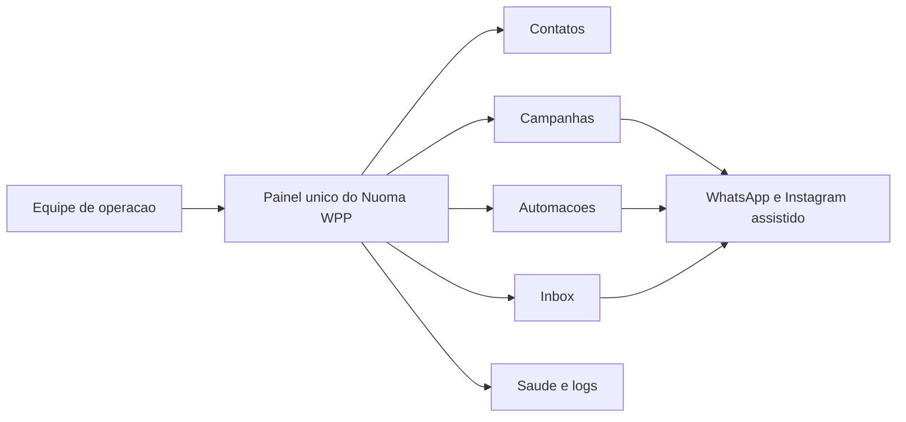

# Diagrama Simplificado Para Cliente

## O que este diagrama mostra

Este diagrama foi pensado para quem nao precisa entrar em detalhes de implementacao. Ele mostra que o projeto entrega um painel unico de operacao, a partir do qual a equipe acompanha contatos, conversas, campanhas, automacoes e o estado do ambiente.

Tambem fica claro o papel pratico do sistema: ele organiza a rotina em torno dos canais que ja fazem parte da operacao, sem depender de varios pontos soltos de controle. Em vez de explicar como o software foi construido, o foco aqui e mostrar como ele se apresenta como ferramenta de trabalho.
