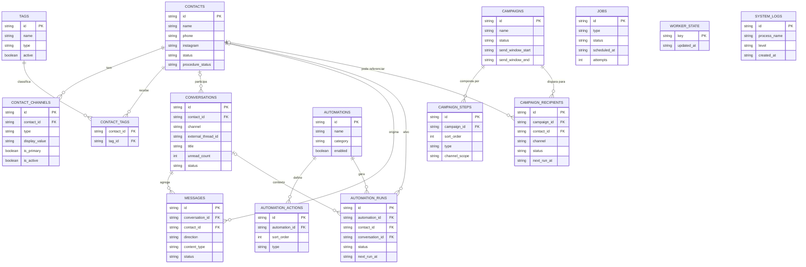

# Diagrama de Entidades Principais

## O que este diagrama mostra

Este modelo resume as entidades mais importantes da base atual, sem tentar representar todas as tabelas auxiliares. O centro funcional do sistema fica em quatro blocos: contatos, conversas, automacoes e campanhas. A partir deles, o projeto organiza classificacao por tags, historico de mensagens e execucao operacional por jobs.

O diagrama tambem evidencia que o sistema nao e apenas uma lista de contatos. Ele combina relacionamento, execucao e monitoramento. `worker_state` e `system_logs` aparecem como apoios de observabilidade, enquanto `campaign_recipients` e `automation_runs` mostram onde a operacao efetivamente vira fila e processamento.
