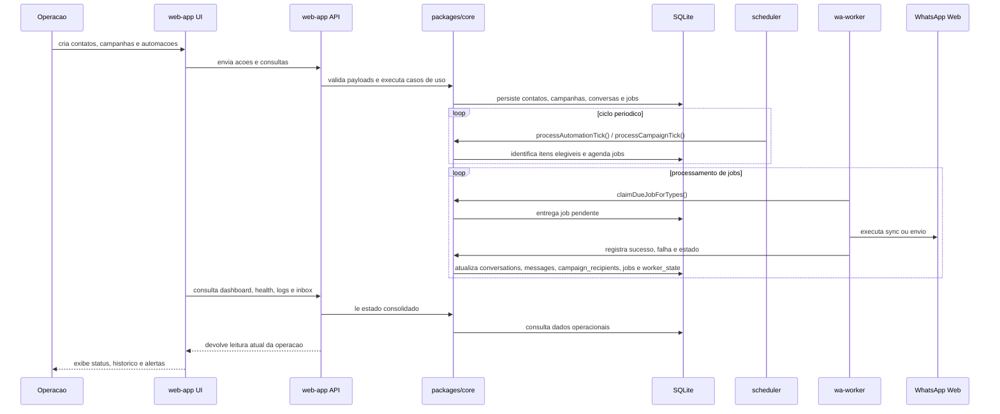

# Diagrama de Fluxo Principal

## O que este diagrama mostra

Este fluxo representa o caminho principal do sistema no dia a dia. A operacao cadastra ou configura dados pela interface, o `web-app` valida e persiste essas informacoes, o `scheduler` identifica o que precisa acontecer nos ciclos periodicos e o `wa-worker` executa syncs e envios no navegador persistente.

No fechamento do ciclo, o mesmo conjunto de componentes alimenta o painel operacional. Por isso dashboard, inbox, health e logs nao sao camadas separadas: eles sao leituras diferentes do mesmo estado consolidado no banco e no runtime dos processos.
