# Nuoma WPP

## Manual Executivo Visual

Guia de leitura do sistema em linguagem clara, com foco no que foi construído, como a operação navega pelas telas e como interpretar o estado do ambiente no dia a dia.

> **Resumo executivo**
>
> O `Nuoma WPP` organiza a operação em um único ambiente local, reunindo contatos, conversas, campanhas, automações e monitoramento operacional. O ganho mais prático está em reduzir improviso, consolidar contexto e dar mais previsibilidade à rotina da equipe.

## Sumário

- [Visão Geral](#visão-geral)
- [O Que Existe Hoje](#o-que-existe-hoje)
- [Jornada Operacional](#jornada-operacional)
- [Mapa Visual Do Sistema](#mapa-visual-do-sistema)
- [Tour Das Telas](#tour-das-telas)
- [Como Ler Os Status](#como-ler-os-status)
- [Leitura Da Captura Atual](#leitura-da-captura-atual)
- [Benefícios Para O Negócio](#benefícios-para-o-negócio)
- [Visão Futura](#visão-futura)

## Visão Geral

O projeto foi concebido para apoiar uma operação interna que precisa de mais ordem, mais continuidade e mais visibilidade. Em vez de depender de controles paralelos e ações manuais dispersas, a equipe passa a trabalhar dentro de um mesmo ambiente operacional.

Na prática, o sistema combina quatro frentes centrais:

- organização de contatos e histórico
- acompanhamento de conversas em um inbox único
- campanhas e automações para rotinas recorrentes
- leitura de saúde do ambiente, eventos e logs

## O Que Existe Hoje

O escopo atual já cobre a espinha dorsal da operação:

| Frente | O que a solução entrega |
| --- | --- |
| Contatos | base consolidada, tags, status e leitura de histórico |
| Conversas | inbox com visão central das interações |
| Campanhas | fluxos com etapas e importação de destinatários |
| Automações | execução de regras para cenários recorrentes |
| Operação | leitura de saúde, eventos, logs e configurações |

## Jornada Operacional

O uso do sistema tende a seguir um fluxo simples e previsível:

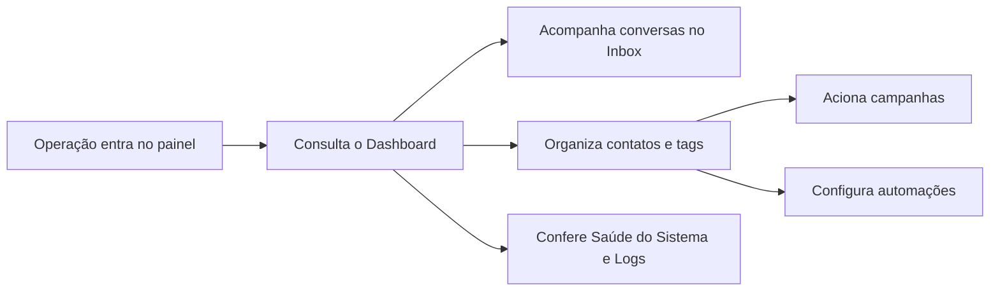

Esse desenho mostra que o `Dashboard` funciona como ponto de leitura da operação, enquanto as demais telas aprofundam a execução. O valor da solução está menos em uma tela isolada e mais na continuidade entre elas.

## Mapa Visual Do Sistema

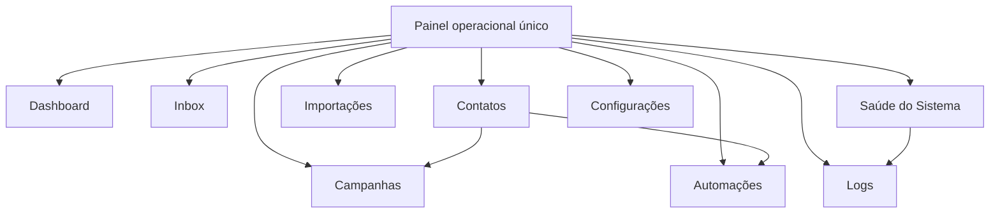

O sistema foi desenhado para que a navegação seja direta. A leitura do contexto começa no painel principal e, a partir dali, a operação aprofunda execução, acompanhamento e manutenção sem trocar de ambiente.

## Tour Das Telas

### 1. Dashboard

O `Dashboard` concentra a leitura mais rápida da operação: canais, atenção operacional, volume de conversas, campanhas ativas e sinais recentes do ambiente.

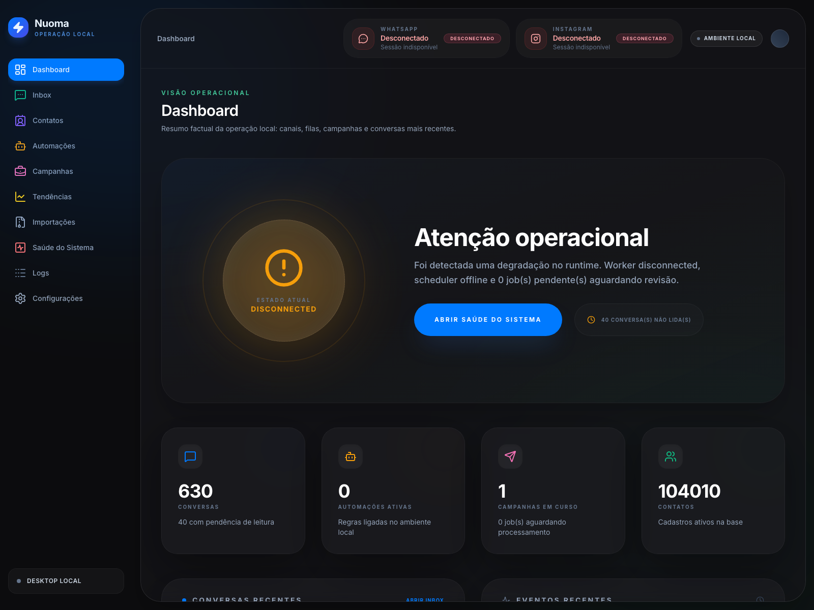

O papel desta tela é responder rapidamente a perguntas como:

- a operação está em condição normal ou exige atenção
- há fila acumulada ou campanhas em andamento
- o ambiente local está estável para seguir a rotina

### 2. Inbox

O `Inbox` organiza o acompanhamento das conversas em um fluxo único, reduzindo perda de contexto e facilitando a continuidade do atendimento.

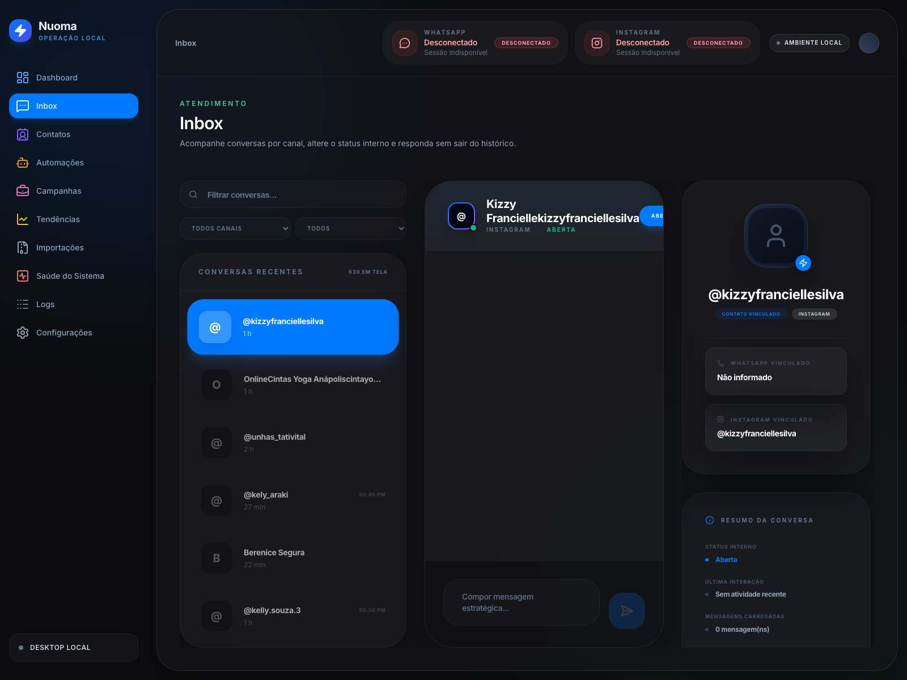

Na prática, esta área apoia a equipe a:

- retomar o histórico com mais rapidez
- evitar ruído entre atendimentos
- operar em um fluxo mais centralizado

### 3. Contatos

A tela de `Contatos` reúne a base operacional do relacionamento, com filtros, status, tags e detalhamento por registro.

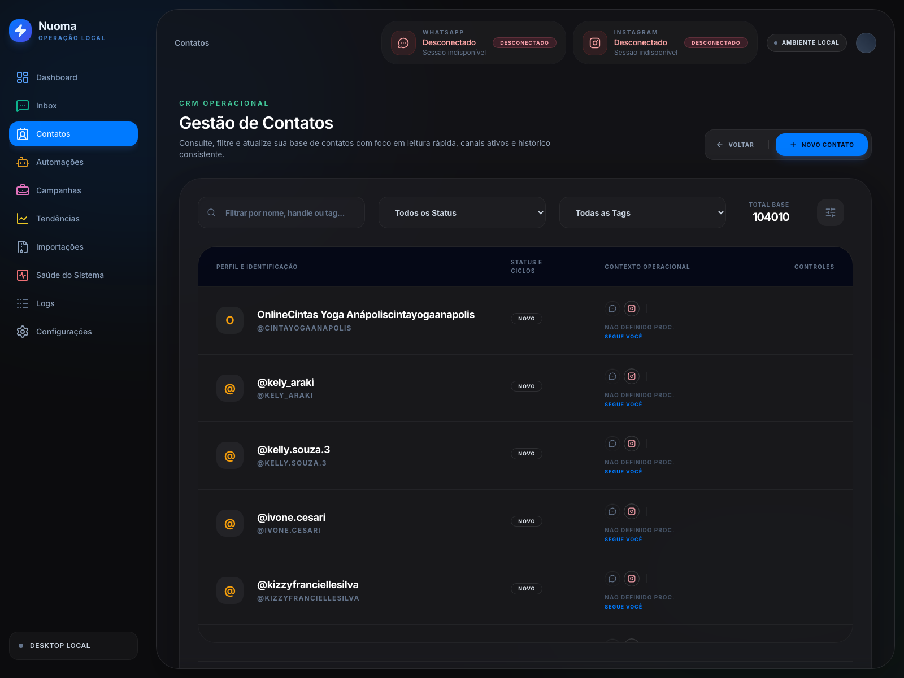

Ela funciona como ponto de organização da carteira e é a base para campanhas, automações e leitura histórica.

### 4. Campanhas

`Campanhas` é a frente de execução em escala. Aqui a operação estrutura envios por etapas, controla andamento e acompanha a execução do fluxo.

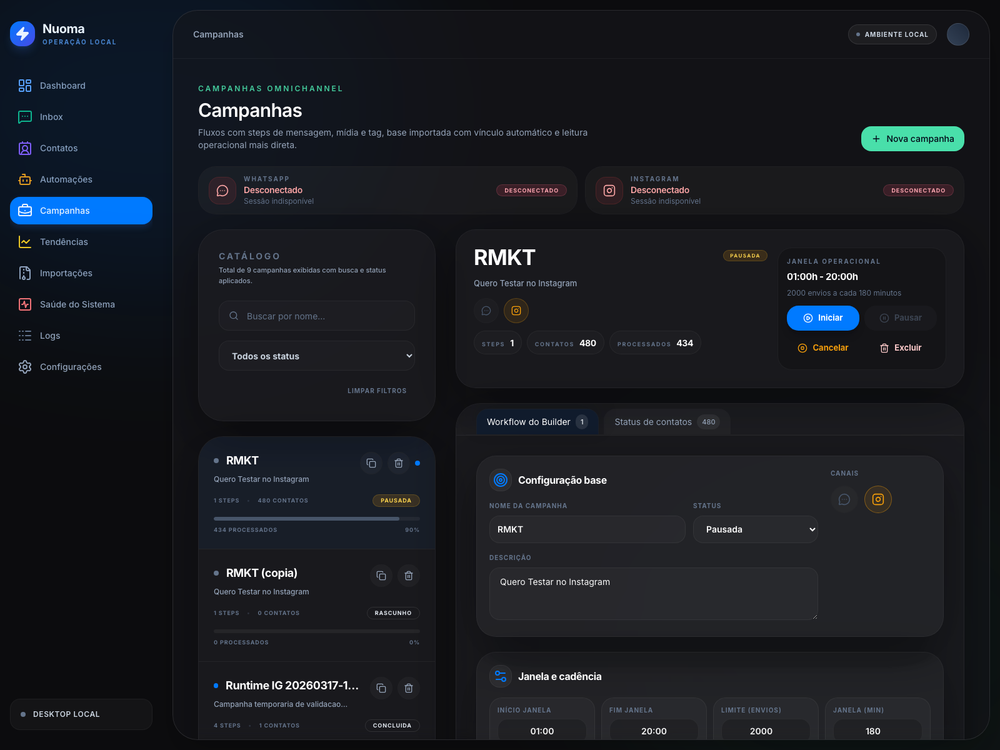

O benefício prático é transformar comunicação recorrente em processo mais padronizado, reduzindo improviso e retrabalho.

### 5. Automações

`Automações` cobre rotinas que podem ser disparadas por regras, ajudando a operação a manter consistência sem depender de ação manual o tempo todo.

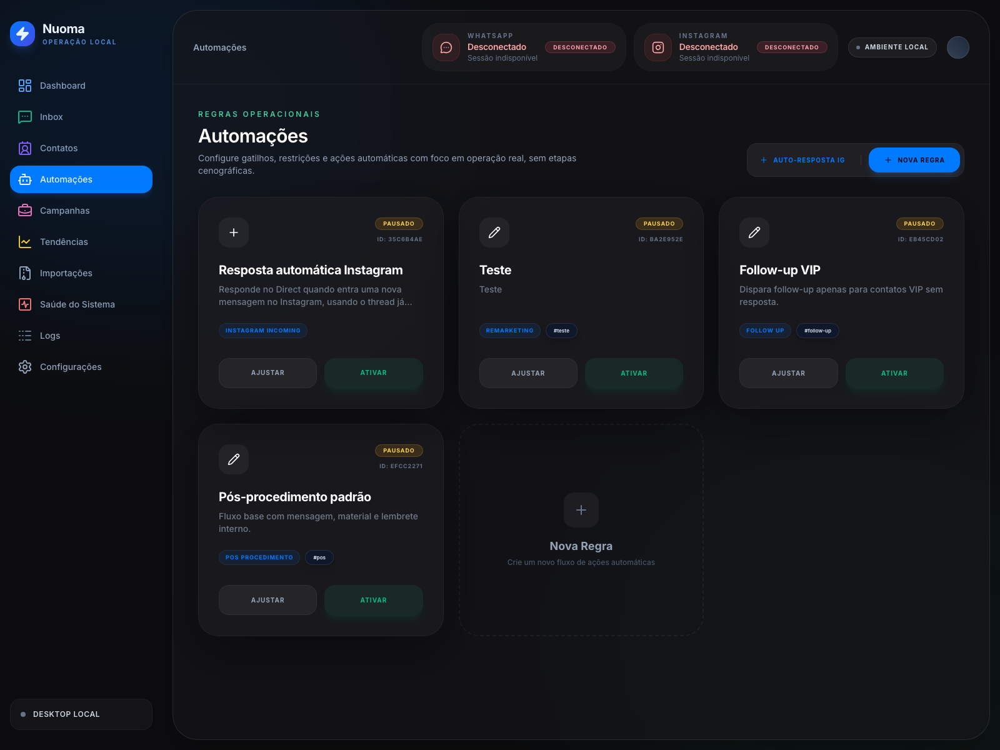

Aqui o valor está em reduzir tarefas repetitivas e dar mais previsibilidade às ações recorrentes.

### 6. Importações

`Importações` apoia a entrada estruturada de dados, especialmente para campanhas e cargas operacionais vindas de arquivo.

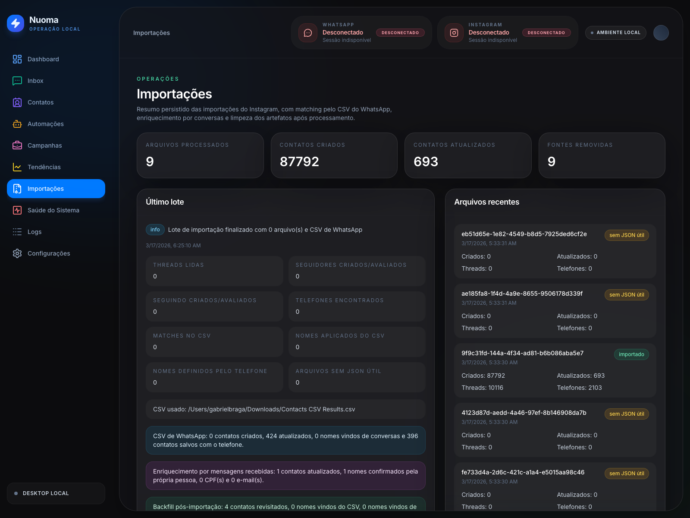

Essa tela ajuda a trazer volume para dentro do sistema sem quebrar a organização da base.

### 7. Saúde Do Sistema

`Saúde do Sistema` é a leitura operacional do ambiente. Ela mostra o estado consolidado do runtime local, incluindo worker, scheduler, banco, canais e eventos recentes.

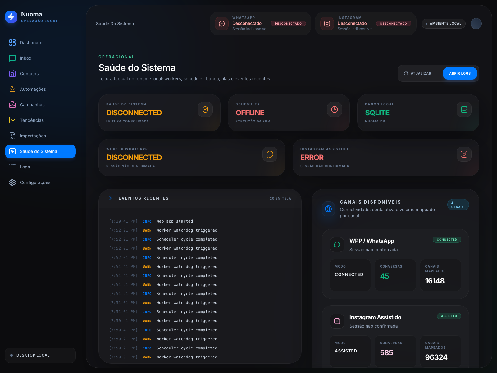

Esta é a tela mais importante para validar se a operação está em condição de seguir normalmente ou se existe algum ponto que exige intervenção.

### 8. Logs

`Logs` dá visibilidade aos registros operacionais recentes e ajuda a localizar sinais de instabilidade, falhas e eventos relevantes.

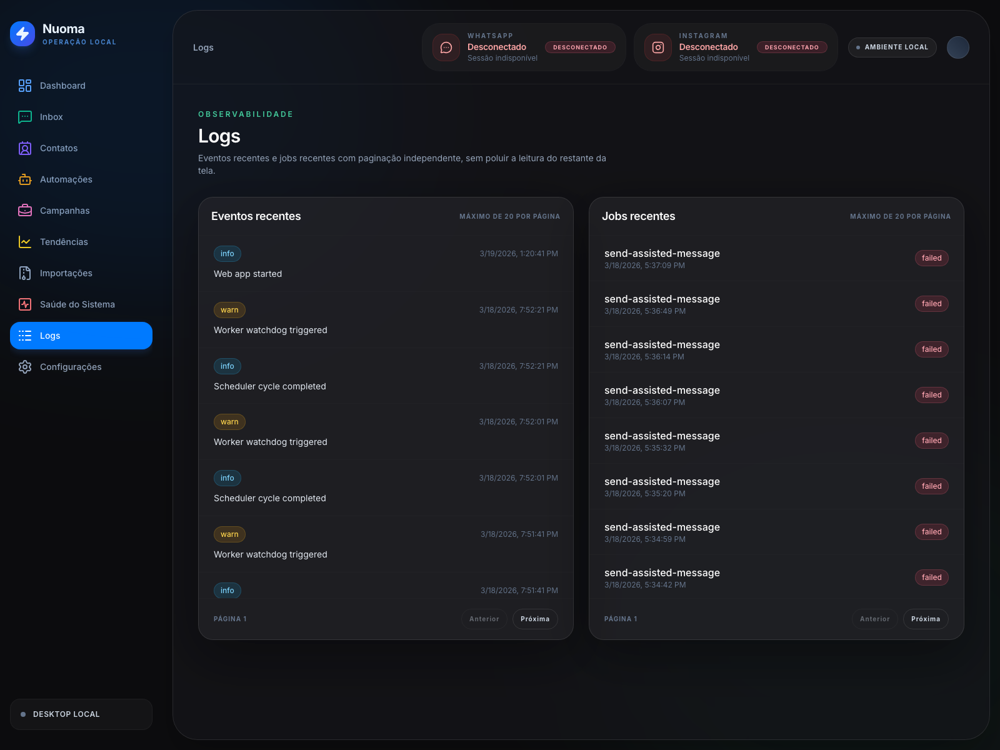

Na prática, é a tela de apoio para diagnóstico rápido e acompanhamento fino do ambiente.

### 9. Configurações

`Configurações` centraliza parâmetros operacionais e ajustes locais do ambiente.

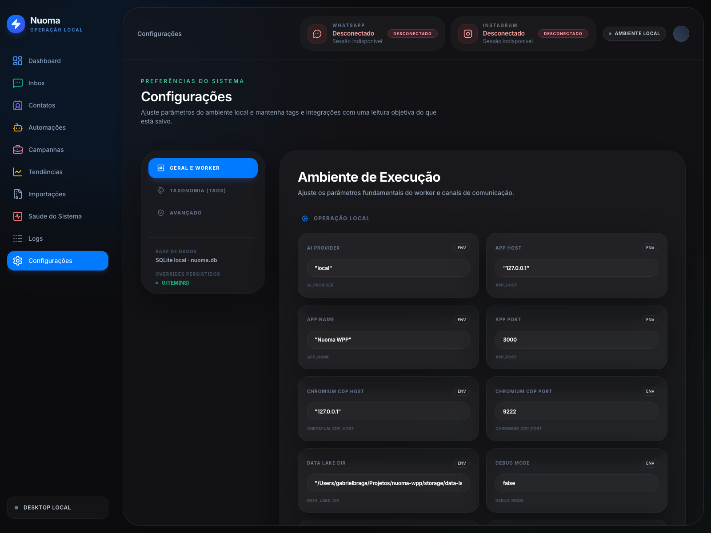

Ela existe para concentrar os pontos de ajuste em um lugar previsível, facilitando manutenção e governança do uso local.

## Como Ler Os Status

A solução já expõe sinais visuais de estado. A leitura recomendada para um cliente não técnico pode ser resumida assim:

| Status visual | Significado prático | Leitura recomendada |
| --- | --- | --- |
| `Connected` / `Authenticated` / `Online` | o componente está em condição normal | seguir operação |
| `Warning` / `Starting` / `Paused` | existe alguma atenção ou transição em curso | acompanhar de perto |
| `Disconnected` / `Offline` / `Error` | há interrupção operacional naquele ponto | revisar antes de continuar |

Essa camada de leitura é importante porque transforma um ambiente técnico em um painel mais compreensível para a rotina do time.

## Leitura Da Captura Atual

As imagens deste manual foram capturadas do sistema real em ambiente local de documentação. Por isso, elas mostram o estado do runtime naquele momento específico, e não uma encenação.

Na captura atual, os sinais mais evidentes são:

- `WhatsApp` aparece desconectado
- `Instagram` aparece desconectado ou sem sessão confirmada
- `scheduler` aparece offline
- o banco local `SQLite` está identificado e acessível

Isso não muda o escopo funcional do produto. Apenas indica que, no momento da captura, a documentação foi gerada sem todos os processos de canal ativos ao mesmo tempo.

## Benefícios Para O Negócio

O valor da solução aparece em cinco frentes muito objetivas:

- mais clareza sobre o que está acontecendo na operação
- menos dependência de processos paralelos e improvisados
- mais consistência para campanhas e rotinas recorrentes
- mais facilidade para acompanhar contexto e histórico
- mais visibilidade para identificar atenção operacional cedo

Em outras palavras, o sistema não serve apenas para registrar informação. Ele existe para organizar a execução.

## Visão Futura

A evolução mais natural do `Nuoma WPP` segue três direções:

- aprofundar governança operacional
- amadurecer a leitura executiva do ambiente
- ampliar escala sem perder clareza de operação

Essa base já permite crescer com mais disciplina, porque o projeto foi estruturado em torno do uso real da operação, e não apenas como uma vitrine de funcionalidades.
