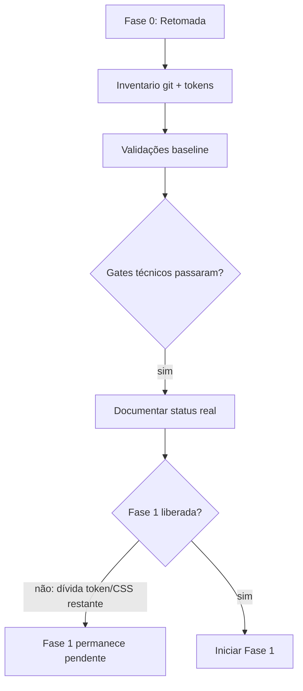

# Rebrand Carvao & Cobre - Fase 0 Retomada

Data: 2026-06-11

## Objetivo

Congelar a verdade do worktree antes de continuar o plano faseado de rebrand,
FlowBuilder, overlay, clean code, docs e validacao visual.

## Estado Do Checkout

- Branch: `feat/rebrand-carvao-cobre`
- Commit base: `9f6d5d2`
- Worktree: sujo, com alteracoes ja aplicadas antes do fechamento formal das
  fases.
- Decisao operacional: nao reverter mudancas sem pedido explicito; estabilizar,
  documentar e seguir por gates de fase a partir deste ponto.

## Diagrama De Retomada

## Validacoes Executadas

| Comando                                        | Resultado                                                                                                                           |
| ---------------------------------------------- | ----------------------------------------------------------------------------------------------------------------------------------- |
| `npm run typecheck --workspace @nuoma/ui`      | passou                                                                                                                              |
| `npm run typecheck --workspace @nuoma/web`     | passou                                                                                                                              |
| `npm run typecheck --workspace @nuoma/worker`  | passou                                                                                                                              |
| `npm run test --workspace @nuoma/web -- --run` | passou, 8 arquivos / 27 testes                                                                                                      |
| `npm run test --workspace @nuoma/worker`       | passou, 11 arquivos / 125 testes                                                                                                    |
| `npm run build --workspace @nuoma/web`         | passou                                                                                                                              |
| `npm run test:v211-overlay-unit`               | passou, 35 testes                                                                                                                   |
| `npm run test:v211-overlay-fab`                | passou                                                                                                                              |
| `npm run test:v211-overlay-panel`              | falhou no smoke CDP com `setData is not a function`; unitarios indicam que o helper existe, provavel sessao/CDP sem reinjecao atual |

## Evidencia Visual

- Login atual: `/tmp/nuoma-rebrand-phase0/login-current.png`

## Inventario Atual

- `apps/web/src/flow-builder/FlowBuilder.tsx`: 3732 linhas.
- `apps/web/src/styles/legacy.css`: 5302 linhas.
- `apps/worker/src/features/overlay/inject.ts`: 3350 linhas.
- `output-worker-*.log`: removidos da raiz; `.gitignore` ja cobre `*.log`.
- Busca ampla `brand-|botforge|orielo|flow-v2|hex/rgb/rgba`: 1432 ocorrencias.

## Alteracoes Ja Aplicadas No Worktree

- FlowBuilder: helpers puros extraidos para `apps/web/src/flow-builder/lib/**`.
- UI operacional: contatos com selecao real, Jobs/Campanhas com confirmacao textual, Chatbots sem defaults pessoais e com selects.
- Inbox: `Esc` deixa de re-selecionar conversa imediatamente; drawer CRM para viewport menor que `xl`.
- Hardening: `api-types.ts`, `format.ts`, `copy.ts` e comparador unico de conversas.
- Overlay: tokens locais Carvao & Cobre, remocao de `oklch`/Geist/gradientes do overlay e microcopy acentuada.
- Limpeza: pet overlay, `NuomaAssistant` e `instagram-observer-script.ts` removidos apos `rg` confirmar zero uso.

## Gate Para Entrar Na Fase 1

Fase 1 ainda nao esta fechada. O subagente de auditoria encontrou os principais
bloqueadores:

- `apps/web/src/styles/legacy.css` concentra a maior parte de `brand-*`,
  `flow-v2`, hex/rgb/rgba.
- `apps/web/src/flow-builder/FlowBuilder.tsx` ainda emite classes
  `nuoma-flow-v2-*`.
- Aliases de compatibilidade ainda existem em `apps/web/src/styles/tokens.css`
  e `packages/ui/src/tailwind/preset.ts`.

O subagente de docs tambem confirmou pendencias para Fase 7:

- Roadmap ainda menciona `Hono`, embora a stack canonica seja Fastify.
- Roadmap marca docs inexistentes como concluidos, incluindo
  `docs/architecture/V2_SYNC_ENGINE.md`.
- A narrativa Liquid Glass/Cartographic ainda aparece como atual em trechos do
  roadmap; Carvao & Cobre deve ser registrado como direcao atual.
- Chrome/Safari extensions existem e precisam entrar no roadmap real.

## Proximo Passo

Antes de qualquer nova fase:

1. Rodar novo inventario `git status --short`.
2. Revalidar contagens de token/CSS.
3. Atacar somente Fase 1 ate reduzir/remover os bloqueadores acima.
4. Atualizar docs e anexar screenshot/relatorio visual da Fase 1 antes de
   considerar a fase concluida.
