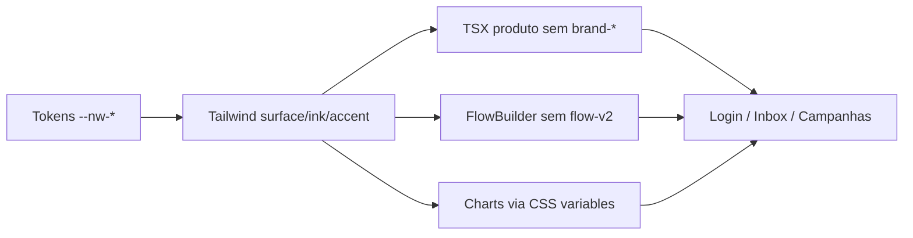

# Rebrand Phase 1 Status

Data: 2026-06-11
Branch: `feat/rebrand-carvao-cobre`
Head validado: `3c24ce6`

## Escopo

Fase 1 do plano Carvao & Cobre: reduzir dependencia visual de nomes antigos,
remover a estetica navy/cyan do FlowBuilder e validar que os componentes de UI
criticos deixam de carregar cores inline permanentes.

## Implementado

- Removido o segundo bloco Indigo/cyan de FlowBuilder em `legacy.css`.
- Renomeada a nomenclatura visual `nuoma-flow-v2-*` para `nuoma-flow-*`.
- Zerei `flow-v2`, `nuoma-flow-v2`, `orielo` e `botforge` em `apps/web/src` e
  `packages/ui/src`.
- Removi `brand-*` de TSX de produto; sobram apenas paginas DEV/evidencia e
  camada compat de tokens/preset.
- Removi `rgb/rgba/hex` inline dos alvos criticos:
  - `apps/web/src/flow-builder/FlowBuilder.tsx`
  - `apps/web/src/inbox/MessageTimeline.tsx`
  - `apps/web/src/inbox/Composer.tsx`
  - `apps/web/src/components/charts/ThemedChart.tsx`
- `ThemedChart` agora le `--nw-*` e usa fallback neutro sem literal RGB.
- `tests/design-system-v3-smoke.mjs` passou a validar as escalas atuais:
  `surface`, `ink`, `accent`, `line`, `status`, `channel`, `chart`.

## Evidencia Visual

Prints salvos fora do repo:

- `/tmp/nuoma-rebrand-phase1/login-desktop.png`
- `/tmp/nuoma-rebrand-phase1/login-mobile.png`

## Validacoes

| Comando | Status |
| --- | --- |
| `npm run typecheck --workspace @nuoma/ui` | passou |
| `npm run typecheck --workspace @nuoma/web` | passou |
| `npm run build --workspace @nuoma/web` | passou |
| `npm run test --workspace @nuoma/web -- --run` | passou |
| `npm run test:design-system-v3` | passou |

## Residuos Controlados

- `legacy.css` ainda existe com 4236 linhas; caiu de 5302 para 4236 nesta fase,
  mas a reducao de 70% fica para as proximas ondas de split por pagina.
- `brand-*` permanece apenas como compatibilidade em `tokens.css` e
  `packages/ui/src/tailwind/preset.ts`, alem de pagina DEV/evidencia.
- Literais de cor seguem permitidos nos arquivos de token e no CSS legado ate o
  split final por dominio.

