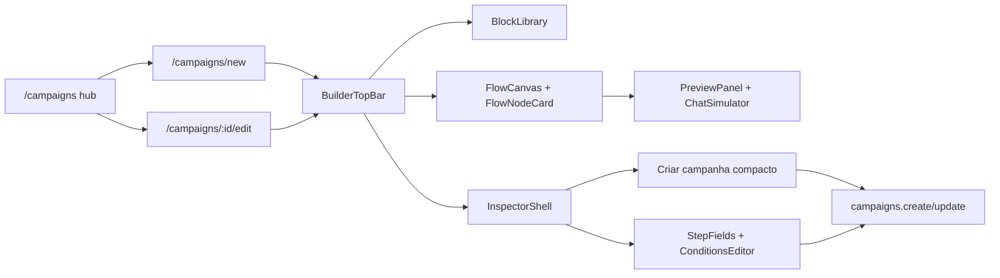

# Rebrand Phase 4 — FlowBuilder V2 Status

Data: 2026-06-11

## Escopo implementado

- Builder de campanha em rota dedicada: `/campaigns/new` e
  `/campaigns/$campaignId/edit`.
- Builder de automação em rota dedicada: `/automations/new` e
  `/automations/$automationId/edit`.
- Canvas ManyChat-style com XYFlow, node cards reais, edges de sequência,
  branch edge, drag/click para adicionar blocos, reorder e preview.
- Stores por reducer em `features/flow-builder/state`.
- Registries tipadas para todos os tipos de step de campanha e action de
  automação.
- Preview com simulador de conversa e teste backend bloqueado quando o canal
  não é suportado pelo contrato atual.
- Painel `Criar campanha` redesenhado para caber no inspector real de ~359px.

## Diagrama

## UX do bloco Criar campanha

O painel anterior empilhava nome, canal, evergreen, agenda, segmentação e
checklist em uma coluna estreita. A versão atual usa:

- `Essenciais`: nome e canal.
- `Envio`: escolha clara entre `Evergreen` e `Manual`, com agendamento opcional
  só quando manual.
- `Audiência`: resumo e switch; regras aparecem em formato compacto somente
  quando ativadas.
- `Prontidão`: chips de validação (`Nome`, `Blocos`, `Canal`, `Público`).

Métrica visual do print final: inspector 359px, `scrollHeight=806`,
`clientHeight=806`, sem clipping.

## Evidências visuais

Os prints ficam fora do repo:

- Conceito gerado por imagem:
  `/tmp/nuoma-rebrand-phase4-current/campaign-create-concept.png`
- Antes:
  `/tmp/nuoma-rebrand-phase4-current/campaign-builder-before.png`
- Depois:
  `/tmp/nuoma-rebrand-phase4-current/campaign-builder-final.png`
- Smoke campanhas:
  `/tmp/nuoma-rebrand-phase4-current/v210-campaigns-smoke-app.png`
- Smoke automações:
  `/tmp/nuoma-rebrand-phase4-current/v210-automations-smoke-app.png`

## Validações executadas

- `npm run typecheck --workspace @nuoma/web`: passou.
- `npm run lint --workspace @nuoma/web`: passou.
- `npm run test --workspace @nuoma/web -- src/features/flow-builder src/flow-builder/lib src/campaigns/campaign-search.test.ts`:
  passou, 7 arquivos, 34 testes.
- `npm run test:v210-campaigns`: passou,
  `builderBlocks=2`, `checklist=4/4`, `campaignStepJobsDelta=0`,
  `blocking=0`, `wppMode=cdp`.
- `npm run test:v210-campaign-builder-mobile`: passou,
  `smallScreenNotice=true`, `documentOverflowPx=0`, `blocking=0`.
- `npm run test:v210-flow-builders`: passou,
  `automationLibraryBlocks=15`, `automationCanvasNodes=6`,
  `automationPreviewEvents=4`, `sendJobsDelta=0`, `blocking=0`,
  `wppMode=cdp`, `ig=nao_aplicavel`.
- `npm run build --workspace @nuoma/web`: passou.

## Limites conhecidos

- Teste backend de Instagram pelo PreviewPanel segue bloqueado porque os
  endpoints atuais aceitam identidade WhatsApp/telefone. A simulação IG existe;
  envio real IG precisa de fluxo específico com evidência e registro de
  campanha.
- Positions do canvas continuam derivadas, não persistidas.
- A/B authoring completo de campanhas ainda fica fora desta fatia; metadados
  existentes são preservados.
