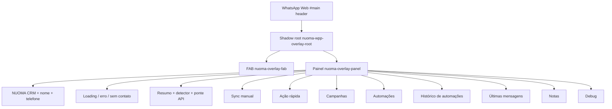

# Rebrand Phase 5 — WhatsApp Overlay HUD

Data: 2026-06-12

## Escopo implementado

- Overlay WhatsApp retematizado para Carvão & Cobre em
  `apps/worker/src/features/overlay/inject.ts`.
- Contratos preservados:
  - `NUOMA_OVERLAY_ROOT_ID = "nuoma-wpp-overlay-root"`.
  - test ids `nuoma-overlay-fab` e `nuoma-overlay-panel`.
  - bindings `__nuomaApi` e `__nuomaApiNativeBridge`.
  - classes usadas por testes: `.nuoma-brand-*`, `.nuoma-panel-body`,
    `.nuoma-action`, `.nuoma-section`.
  - z-index host/panel/backdrop `2147483646/45/44`.
  - `:host { all: initial }`.
- CSS local segue tokens `--nwo-*`; o alias interno `cyan` foi removido.
- FAB ficou flat, radius 10, marca cobre e dot de status preservado.
- Painel sólido com hairline, foco cobre e ações primárias em cobre.
- Header agora mostra `NUOMA CRM`, título e telefone mono sempre visível quando
  detectado.
- Microcopy acentuada:
  - `Automações`.
  - `Últimas mensagens`.
  - `Automação bloqueada`.
  - `Lembrar amanhã`.
  - `ação(ões)`, `número`, `ID único`, `injeção`, `ação sensível`.

## Diagrama



## Evidências visuais

Os prints ficam fora do repo:

- Antes fixture:
  `/tmp/nuoma-rebrand-phase5-overlay/overlay-panel-before-fixture.png`
- Antes WhatsApp/CDP:
  `/tmp/nuoma-rebrand-phase5-overlay/overlay-panel-before-wpp.png`
- Depois fixture:
  `/tmp/nuoma-rebrand-phase5-overlay/overlay-panel-final-fixture.png`
- Depois WhatsApp/CDP:
  `/tmp/nuoma-rebrand-phase5-overlay/overlay-panel-final-wpp.png`
- FAB final WhatsApp/CDP:
  `/tmp/nuoma-rebrand-phase5-overlay/overlay-fab-final-wpp.png`
- Estados final fixture:
  `/tmp/nuoma-rebrand-phase5-overlay/overlay-states-final-fixture.png`

## Validações executadas

- Baseline antes da alteração:
  - `npm run test:v211-overlay-unit`: passou, 35 testes.
  - `npm run test:v211-overlay-panel`: passou, `fixtureBlocking=0`,
    `wppMode=cdp`, `sendJobsDelta=0`.
- Após alteração:
  - `npm run typecheck --workspace @nuoma/worker`: passou.
  - `npm run test:v211-overlay-unit`: passou, 35 testes.
  - `npm run test:v211-overlay-contracts`: passou, 5 testes.
  - `npm run test:v211-overlay-suite`: passou.

Resultado da suite final:

```text
v211-overlay-fab|fixtureMounted=1|wppMounted=1|wppPhone=5531982066263|sendJobsDelta=0|wppMode=cdp
v211-overlay-panel|fixturePanel=1|wppPanel=1|fixtureSections=9|wppSections=9|sendJobsDelta=0|wppMode=cdp
v211-overlay-phone|fixturePhone=5531982066263|wppPhone=5531982066263|sendJobsDelta=0|wppMode=cdp
v211-overlay-api|fixtureApi=online|wppApi=online|wppPhone=5531982066263|sendJobsDelta=0|wppMode=worker-cdp-binding
v211-overlay-campaign-data|campaigns=77|overlayEnabled=0|status=skipped
```

## Observações

- Esta fase não executou envio real. Os smokes de overlay validam montagem,
  ponte API, detecção de telefone, painel e prints no WhatsApp real via CDP,
  mantendo `sendJobsDelta=0`.
- `overlay-campaign-data` ficou `skipped` porque a base local não tinha
  campanha `overlayEnabled`; isso é comportamento esperado do smoke.
