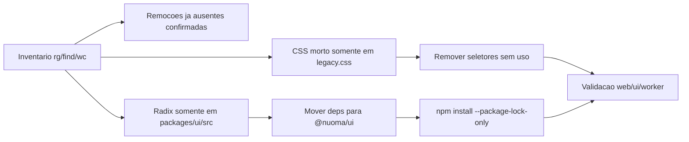

# Fase 6 — Clean Code e Lixo

Data: 2026-06-12
Status: validada

## Escopo

- Remover ou reconfirmar arquivos orfaos do plano de rebrand.
- Remover logs operacionais da raiz e garantir ignore explicito.
- Reduzir CSS morto com prova de zero uso.
- Corrigir duplicacao de dependencias Radix entre `apps/web` e `packages/ui`.
- Registrar backlog estrutural sem abrir refactors fora do escopo.

## Resultado

- `apps/web/src/pet-overlay/**`: ausente no checkout, sem referencias ativas.
- `apps/web/src/shell/NuomaAssistant.tsx`: ausente no checkout, sem referencias
  ativas.
- `apps/worker/src/sync/instagram-observer-script.ts`: ausente no checkout, sem
  referencias ativas.
- `output-worker-*.log`: nenhum arquivo encontrado na raiz; `.gitignore` ganhou
  padrao explicito.
- `packages/ui` passou a declarar Radix como dependencia propria. `apps/web`
  nao declara mais Radix porque nao importa esses pacotes diretamente.
- `apps/web/src/styles/legacy.css` caiu de 4264 para 2112 linhas.

## Diagrama

## Seletores CSS removidos

- `nuoma-flow-*`
- `nuoma-signal-*`
- `nuoma-glass-modal`
- `botforge-grid`
- `botforge-title`

## Compat CSS preservado

Preservado porque ainda ha uso ativo em paginas canonicas ou DEV:

- `nuoma-compat-*`
- `nuoma-glass-panel`
- `nuoma-glass-elevated`
- `nuoma-jobs-*`
- `nuoma-implementation-*`

## Backlog estrutural documentado

Estes hotspots continuam fora do escopo desta fase e devem ser quebrados em
PRs proprios quando houver demanda de produto ou manutencao:

- `apps/worker/src/sync/cdp.ts`
- `apps/worker/src/job-handlers.ts`
- `apps/api/src/app.test.ts`
- `apps/api/src/trpc/routers/campaigns.ts`
- `apps/worker/src/instagram/sync.ts`

## Validacao

Executada nesta fase:

- `npm run typecheck --workspace @nuoma/ui`
- `npm run typecheck --workspace @nuoma/web`
- `npm run typecheck --workspace @nuoma/worker`
- `npm run test --workspace @nuoma/ui`
- `npm run test --workspace @nuoma/web`
- `npm run test --workspace @nuoma/worker`
- `npm run build --workspace @nuoma/web`
- `npm run lint`
- `git diff --check`
