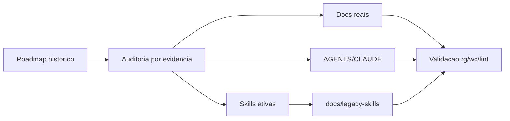

# Fase 7 — Docs, Roadmap, AGENTS, CLAUDE e Skills

Data: 2026-06-12
Status: validada

## Escopo

- Corrigir roadmap para refletir Fastify, SSE global, docs reais e companions
  V2.
- Registrar Carvão & Cobre como direção visual atual, deixando
  Cartographic/Liquid Glass como histórico.
- Atualizar `AGENTS.md`, `CLAUDE.md` e contexto sob demanda.
- Reduzir `.claude/skills` de 18 para 7 arquivos úteis.
- Arquivar skills/aliases antigos sem apagar conteúdo.

## Resultado

- Novos docs:
  - `docs/architecture/V2_SYNC_ENGINE.md`
  - `docs/architecture/V2_REALTIME.md`
  - `docs/design-system/MOTION.md`
- Skills ativas:
  - `nuoma-v2-feature`
  - `nuoma-worker-observability`
  - `wa-session-runbook`
  - `v1-to-v2-data-import`
  - `nuoma-cutover-checklist`
  - `wa-voice-regression`
  - `nuoma-review`
- Skills arquivadas em `docs/legacy-skills/`:
  - aliases antigos de feature/page/component/builder/inbox/refactor/segment.
  - skills consolidadas antigas `nuoma-api`, `nuoma-debug`, `nuoma-migration`.
  - spikes antigos `wa-cdp-sync-spike` e `v1-to-v2-migration-dryrun`.

## Diagrama

## Decisões

- Hono permanece apenas como alternativa histórica descartada; stack atual é
  Fastify.
- `/api/events` é o SSE global atual; `/api/inbox/events` fica como compat.
- Cartographic/Liquid Glass permanece em ADR histórico; Carvão & Cobre é a
  direção atual da web canônica e do overlay.
- `pet-overlay` permanece removido.
- Companions V2 (`apps/chrome-extension`, `apps/safari-extension`) são satélites,
  não stack principal.

## Validação

Executada nesta fase:

- `rg -n "Hono|Liquid Glass|Cartographic|V2_SYNC_ENGINE|V2_TYPOGRAPHY|pet-overlay|Carvão|Cobre" docs .claude AGENTS.md CLAUDE.md`
  - Resultado esperado: ocorrências restantes são históricas, direção atual
    Carvão & Cobre, ou registros de remoção de `pet-overlay`.
- `wc -c CLAUDE.md AGENTS.md .claude/skills/*.md`
  - Resultado: 16.148 chars totais; `.claude/skills` ficou em 7 arquivos.
- `npm run lint`
- `test -f` para docs principais:
  - `docs/architecture/V2_SYNC_ENGINE.md`
  - `docs/architecture/V2_REALTIME.md`
  - `docs/design-system/MOTION.md`
  - `docs/design-system/CARVAO_COBRE_TOKENS.md`
- Revisão manual de links relativos principais.
