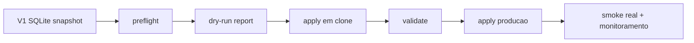

# V2.15 Cutover Plan - V1 para V2

Status: operacional para ensaio e cutover controlado. Este documento e a fonte canonica da V2.15. O rollback detalhado fica em `docs/runbooks/CUTOVER_ROLLBACK.md`.

## Escopo

A migracao V2.15 usa `@nuoma/migration` para ler o SQLite V1 em modo read-only e escrever no SQLite V2. O V1 nunca e alterado.

Fluxo:



## Comandos

Preflight:

```bash
npm run migration:v215:preflight
```

Dry-run:

```bash
npm run migration:v215:dry-run -- --report=data/reports/v215-dry-run.json
```

Apply em clone ou producao:

```bash
V215_CONFIRM_CUTOVER=SIM npm run migration:v215:apply -- --report=data/reports/v215-apply.json
```

Validacao:

```bash
npm run migration:v215:validate -- --report=data/reports/v215-validate.json
```

Variaveis principais:

- `V215_V1_DB_PATH`: caminho do SQLite V1.
- `V215_V2_DB_PATH`: caminho do SQLite V2.
- `V215_BACKUP_DIR`: destino do backup pre-cutover do V2.
- `V215_V1_STORAGE_ROOT`: raiz onde paths relativos de midia do V1 sao resolvidos.
- `V215_MEDIA_TARGET_ROOT`: destino de midias copiadas para o V2.
- `V215_TARGET_USER_ID`: usuario V2 dono dos dados migrados, default `1`.
- `V215_CONFIRM_CUTOVER=SIM`: obrigatorio para `apply`.

## Ordem de import

1. Confirmar ou criar usuario admin V2.
2. Tags.
3. Attendants.
4. Contacts.
5. Contact tags.
6. Media assets metadata e copia fisica de arquivos.
7. Conversations.
8. Messages.
9. Campaigns com steps embutidos.
10. Campaign recipients.
11. Campaign executions legadas como `system_events`.
12. Automations com actions embutidas.
13. Automation runs/state como `system_events`.
14. Chatbots.
15. Chatbot rules.
16. Jobs vivos do V1 (`pending`, `processing`, `queued`, `running`).
17. Reminders.
18. Audit logs.
19. System logs/events.
20. `data_lake_*` ignorado com contagem no relatorio.

## Gates

Todos precisam estar verdes antes do apply real:

- V1 DB legivel e `PRAGMA quick_check = ok`.
- V2 DB legivel, migrado e com `targetUserId` valido.
- V2 sem jobs ativos que nao tenham sido importados pela propria V2.15.
- Backup V2 recente existe.
- Prova M303 de envio 24h/90d existe quando o gate esta ativo.
- Dry-run gera contagens esperadas.
- Apply em clone passa e e idempotente.
- `npm run test:v215-cutover-preflight` passa.
- `npm run test:v215-cutover-apply` passa.

## Decisoes de rollback

Rollback e permitido antes da troca da sessao primaria do WhatsApp para o V2.

Depois que o numero primario for autenticado no V2 e envio real for liberado, rollback so ocorre se houver falha critica em envio, sync, audio ou campanha. Nesse caso, seguir `docs/runbooks/CUTOVER_ROLLBACK.md`.

## Smoke T+0

Registrar evidencia:

- Print do app V2 com Inbox carregada.
- Print do WhatsApp ou evidencia CDP do envio/recebimento.
- Envio texto real para contato canario.
- Envio audio nativo se IC-1 estiver no escopo do cutover.
- Campanha pequena ou dry-run operacional, conforme janela de risco.
- Registrar `IG nao aplicavel` quando o teste nao envolver Instagram.

## Pos-cutover

- Rodar `migration:v215:validate`.
- Rodar resync geral das conversas prioritarias.
- Monitorar `system_events`, jobs e memoria por 24h.
- Gerar backup V2 pos-migracao.
- Manter V1 read-only por 30 dias.
